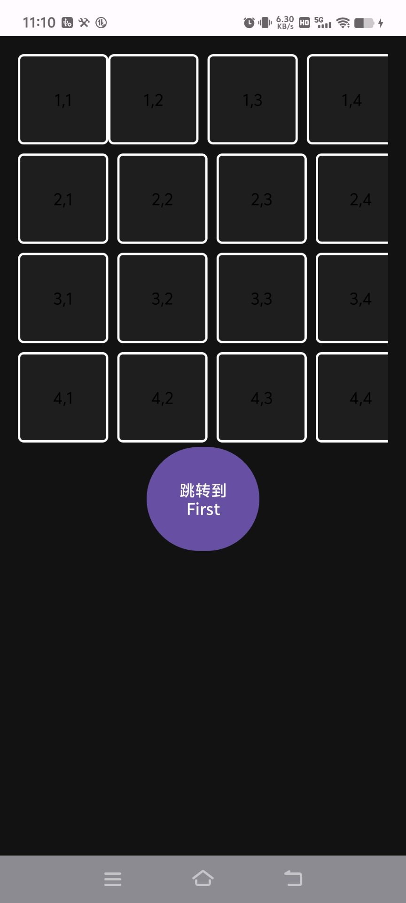
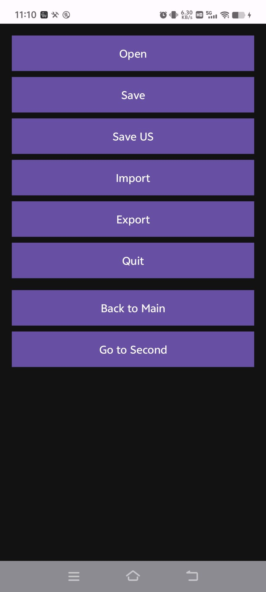
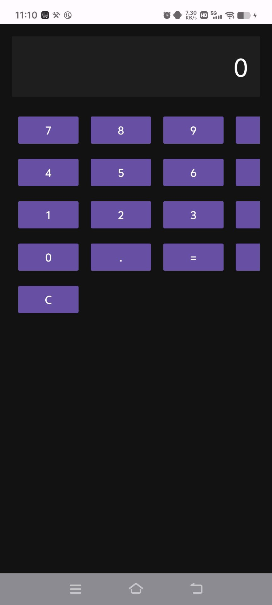
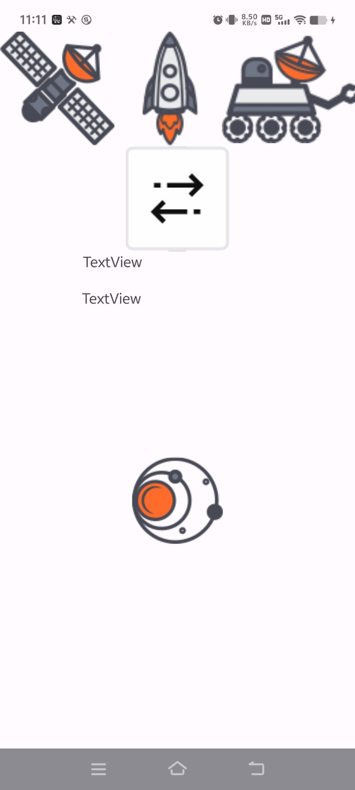
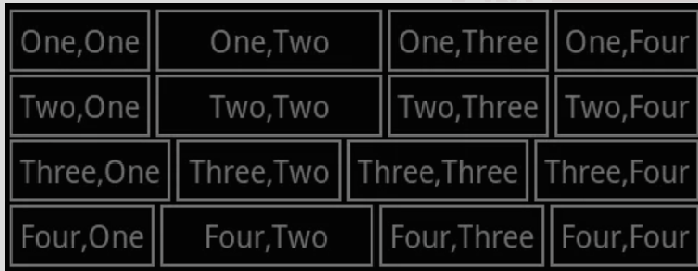
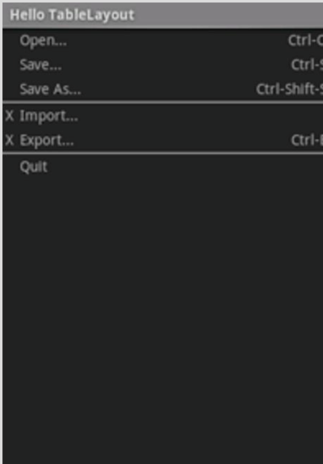
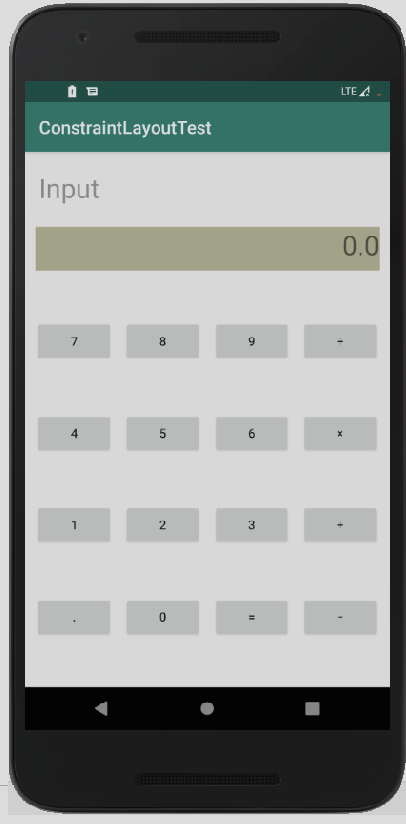
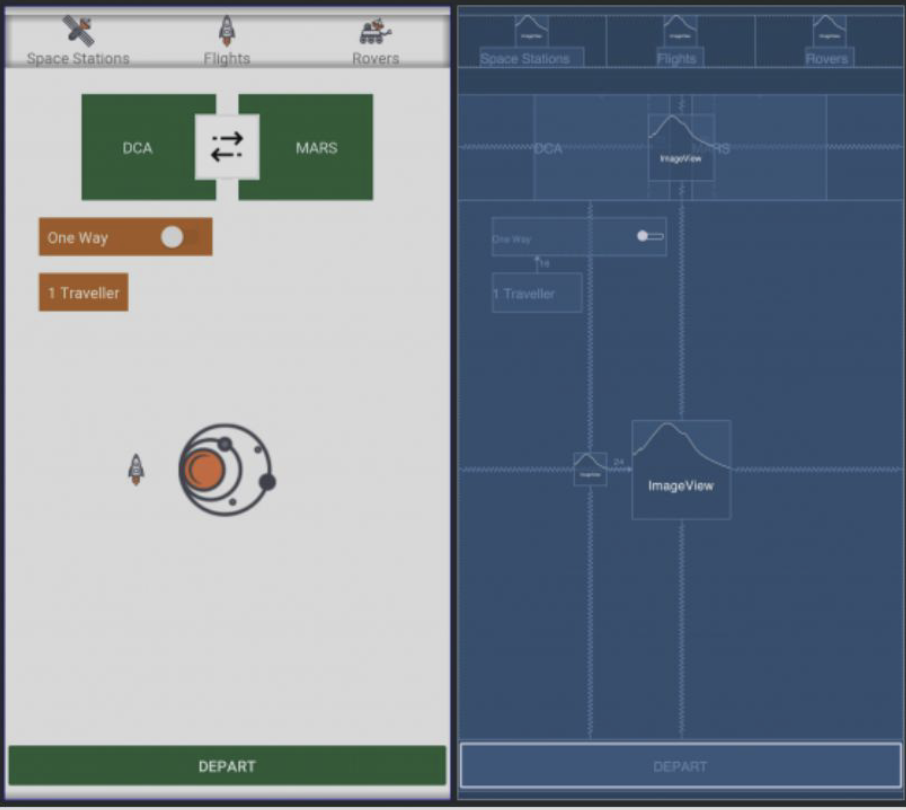

# 实验2

> 本实验目标是实现多个布局要求

> 布局要求：
    1.线形布局实现一个4*4的不严格对齐的表格
    2.用表格布局实现一个列表
    3.实现一个计算器布局
    4.根据题目样本实现布局约束

## 1. 运行环境
- Android Studio 2025.1.3（Koala / Narwhal 系列）
- Kotlin / Jetpack Compose / Material 3
- Room (SQLite) + MVVM + Navigation
- minSdk 24，targetSdk 36

## 2. 项目结构
app/src/main/java/com/example/myapplication
├─ MainActivity.java　# 表格
├─ FirstActivity.java　# 列表
├─ SecondActivity.java　# 计算器
└─ ThridActivity.java　# 图片

## 3. 功能清单（对齐实验要求）
| 实验要求             | 对应文件                    | 功能展示                               |
| ---------------- | ----------------------- | ---------------------------------- |
| 1. 线性布局实现 4×4 表格 | **MainActivity.java**   |  |
| 2. 表格布局实现列表      | **FirstActivity.java**  |  |
| 3. 计算器布局         | **SecondActivity.java** |  |
| 4. 约束布局（根据样本实现）  | **ThridActivity.java**  |  |

## 4. 关键实现思路（简述）
1. 通过 LinearLayout 和 TextView 进行 行的划分和每行的内容。
2. 使用 LinearLayout 作为容器，存储 button
3. GridLayout 通过设置 columnCount 和 rowCount 来进行布局

## 5. 快速上手
1) 用 Android Studio 打开工程，等待 Gradle Sync 完成。
2) 连接真机或启动模拟器，选择想看的界面点击 **Run ▶**。

## 6. 实验总结（示例文字，可直接保留）
- 本次实验通过对线性布局、表格布局、网格布局与约束布局的综合练习，系统掌握了 Android 界面布局的多种实现方式与特点。在实现过程中，进一步理解了不同布局在组件对齐、空间分配、嵌套结构等方面的差异与适用场景。同时，结合实际界面设计，熟悉了在 Android Studio 中预览、调试与优化布局的方法，为后续更复杂的界面开发打下了良好的基础。

## 7. 参考（来自实验PDF给出的参考方向）

- 以下是来自pdf的参考样本

